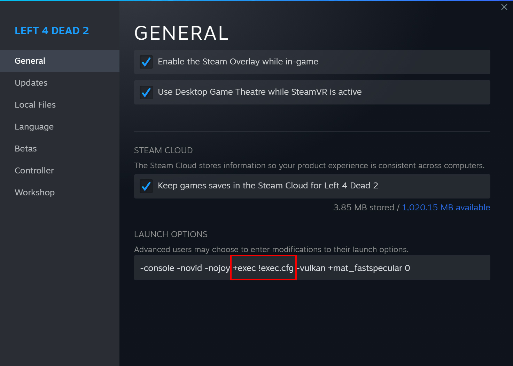

### L4D2 Navmesh Edit CFG set
This set of CFG files will make navmesh editing in L4D2 easier.
It contains pre-bound commands for selecting, editing, drawing lowering/raising and otherwise altering navmesh. As well as a file to toggle Population editing and assigning places easier.

Check ``!Navmesh`` and ``!NavPopulationEditToggle`` to see the accumulated commands and their assigned keybinds.<br>
Each command has an explanation on what it does. You can also change the keybinds if you want.

⚠️ **Warning:**<br>
    !Navmesh.cfg writes a config file based on your current settings in order to not overwrite your keybinds.<br>
    But this includes all settings, including resolution, sound volume, Field-Of-View, ect.<br>
    If you change your settings, you should run ``host_writeconfig !navundo_defaultbinds.cfg`` to stop Navmesh mode from reverting settings.
 
### Install
<details>
<summary>Click me to expand instructions</summary>

1. Download and unpack this repo into ```steamapps\common\Left 4 Dead 2\left4dead2\cfg```.
2. Create an autoexec file file called ```exec.cfg``` in ```steamapps\common\Left 4 Dead 2\left4dead2\cfg``` containing the following:<br>
```
bind home "exec L4D2_Navmesh_CFG-main/!NavPopulationEditToggle"  //Bind Home to population edit mode.
bind pgup "exec L4D2_Navmesh_CFG-main/!Navmesh"                  //Bind PageUp to enable navmesh mode.
bind pgdn "exec L4D2_Navmesh_CFG-main/!Navmesh_undo"             //Bind PageDown to disable navmesh mode.
echo "Write new config using: host_writeconfig 	!navundo_defaultbinds.cfg"
```
You can edit the keybinds if you want. I just happen to not use these keys for anything yet.
   
3. add ```exec !exec.cfg``` to your launch options.

  
4. When in a map, press PageUp to enter NavEdit mode. Unless you changed keybinds.
</details>
